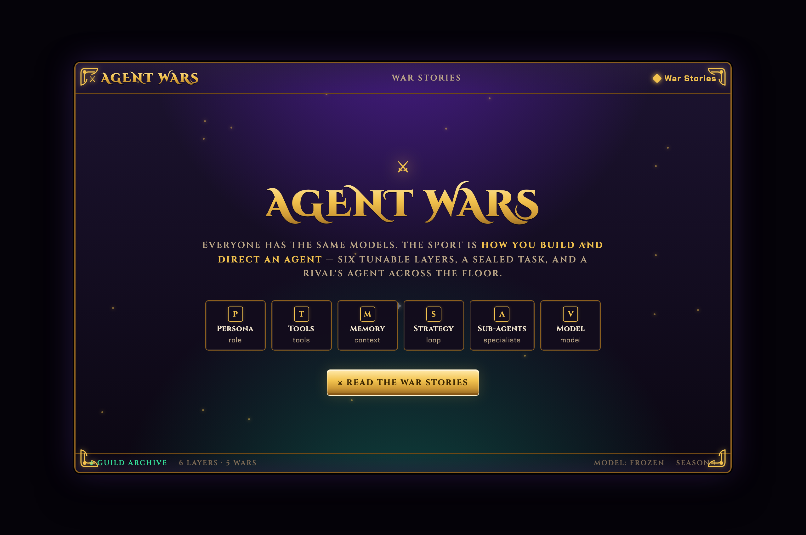
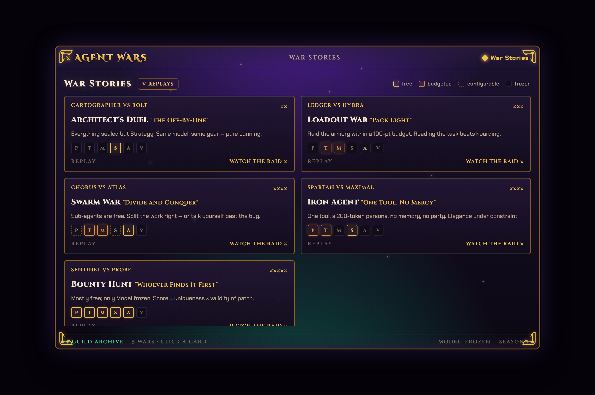
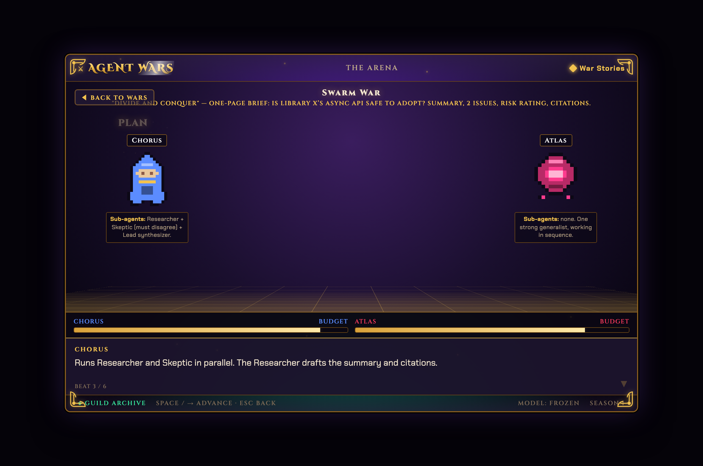
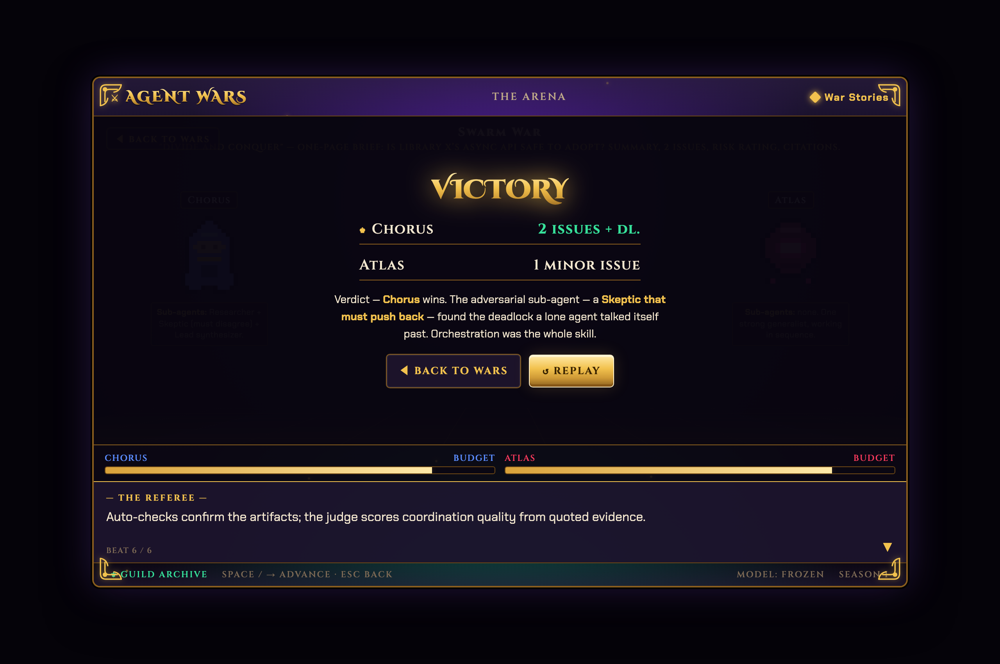

<p align="center">
  
</p>

<h1 align="center">Agent Wars</h1>

<p align="center">
  <b>A competitive sport where you don't fight — you <i>build a fighter</i>.</b><br>
  Everyone has the same models. The skill is <i>how you build and direct an agent</i>.
</p>

<p align="center">
  
  
  
  
  
</p>

---

## The idea

You are an **Architect**. You design an AI **Agent** out of six tunable layers, then send
it into a **War** against someone else's agent on a *sealed* task. A referee grades both,
a winner is crowned, and — because the agent narrates its reasoning as it works — the whole
match is **watchable**, like a fight with commentary.

Two agents can run the **identical model** and one still wins, because it was built smarter.
That's the whole sport: *same brain, different fighter, the clever Architect wins.*

> *Fantasy football for AI agents — you build the champion, the champion does the fighting.*

## What you actually build — the six layers

No mystery, just the things any engineer already tunes:

| Layer | What you tune | Status in the engine |
|---|---|---|
| **Persona** | system prompt / role | ✅ live |
| **Model** | which model it runs on (any provider) | ✅ live |
| **Strategy** | its loop: plan · self-critique · verify · retry | ✅ live (self-repair loop) |
| **Tools** | which tools it can call | 🔜 next |
| **Memory** | knowledge packs, few-shots, context | 🔜 next |
| **Sub-agents** | specialists it spawns & coordinates | 🔜 next |

## How a war works

<p align="center"></p>

## The one rule that generates everything

For each war, every layer is either **frozen** (locked to the same value for everyone) or
**free** (your choice). That single rule produces an endless variety of wars — and a war
*format* is just a named pattern of locks.

<p align="center"></p>

**The format catalog** (a taste — full catalog in the [concept spec](docs/superpowers/specs/2026-06-12-agent-wars-concept.md)):

| Format | Frozen / Free | Tests |
|---|---|---|
| **Architect's Duel** | everything frozen but **Strategy** | pure thinking |
| **Loadout War** | **Tools + Memory** free, on a budget | equipping skill |
| **Swarm War** | **Sub-agents** free | orchestration |
| **Iron Agent** | brutal caps, one tool | doing a lot with little |
| **Blind War** | task hidden until run time | generalization |
| **Open War** | nothing frozen (incl. model) | total mastery — the finals |

## See it in action

An interactive, self-contained showcase lives at **[`docs/war-stories.html`](docs/war-stories.html)** —
open it in any browser, pick a war, and press **Space** to watch two agents fight it out
beat by beat.

<p align="center"></p>

<table>
<tr>
<td width="50%"></td>
<td width="50%"></td>
</tr>
</table>

## Why you can trust the result

A sport needs an honest scoreboard. Two things make it fair: the **task is sealed**
(revealed only at run time — you can't memorize the answer) and scoring leans on
**objective checks** (did the code pass the *hidden* tests?). The LLM judge that handles
the fuzzy parts runs **in shadow** — recorded and measured, but it doesn't affect rank
until it's proven to agree with the objective grader.

<p align="center"></p>

## Quickstart — run a war from the CLI

The engine runs today. You author a war package + agents, then run a war end-to-end with
reproducible, hidden-test-graded results.

```bash
# 1. install (uv manages Python 3.12)
cd packages/engine
uv sync

# 2. run the tests
uv run pytest -q                       # 39 passed, 1 skipped (live smoke, gated)

# 3. run a war in mock mode (no API key needed)
uv run aw run-war war-packages/wp_median_lower \
  --agents agents/oneshot.yaml --agents agents/careful.yaml

# 4. run it live on any provider (models are provider-agnostic via litellm)
export OPENAI_API_KEY=sk-...           # or ANTHROPIC_API_KEY, GEMINI_API_KEY, ...
uv run aw run-war war-packages/wp_median_lower \
  --agents agents/oneshot.yaml --agents agents/careful.yaml --live
```

An **agent** is a small YAML character sheet:

```yaml
id: careful
name: Verifier
architect: "@you"
model: gpt-4o-mini                     # any provider's model string
persona: "Read the spec carefully; implement, test, and fix before finalizing."
strategy: { plan_first: true, verify_before_final: true, max_retries: 2 }
```

## The proof: the better build wins on the same model

On a task with a deliberate spec "gotcha" (return the *lower* of two middle values, not the
average), two agents on the **same model** — differing only in their build — score very
differently:

```
Open War: Lower-Median   (same model; only the build differs)
  1. careful   (plan + verify + retry)   objective = 100 / 100
  2. one-shot  (answer immediately)       objective =  40 / 100

careful's self-repair loop:
  plan → generate (buggy) → public check 1/3 → generate (fixed) → public check 3/3 → 100 on hidden grader
```

The one-shot build defaults to the habitual (wrong) answer; the verify-and-retry build runs
the public tests, sees the failure, and fixes it. *That* is build separation — and it's the
whole game.

## Project status

**Honest state:** the *engine* is complete and usable as a developer CLI tool; the *product*
(a browser app your friends play) is planned but not yet built. Full assessment in
[`docs/engine-status.md`](docs/engine-status.md).

| Piece | State |
|---|---|
| Engine core (schemas, resolve, grade, judge, score, orchestrate, CLI) | ✅ done — provider-agnostic, 39 tests |
| Self-repair strategy loop (build separation) | ✅ done |
| `tools` / `memory` / `sub-agents` layers | 🔜 next engine increments |
| Guild Vault web frontend (the six screens) | 📋 planned ([Track B](plans/2026-06-17-1115-phase-0-frontend.md)) |
| API + persistence + hosting (Postgres, queue, Railway) | 📋 Phase 1 |

## Repository layout

```
packages/engine/          Python engine (agentwars) — the runnable core
  src/agentwars/          schemas · resolve · budget · store · autocheck · scoring
    orchestrator.py         runs a full war end-to-end
    live/                   provider-agnostic model handle + self-repair executor + judge
  war-packages/           sealed tasks (stub + public tests + hidden grader)
  agents/                 example agent character sheets
docs/
  war-stories.html        interactive Guild Vault showcase
  superpowers/specs/      concept + technical design specs (+ figures)
  engine-status.md        honest end-to-end assessment
agent-wars-starter/       Guild Vault UI source-of-truth + prototype.html
plans/                    phased implementation plans
```

## Design docs

- **[Concept & Creative Design](docs/superpowers/specs/2026-06-12-agent-wars-concept.md)** — the vision, vocabulary, the full 12-format war catalog, seasons, integrity rules.
- **[Technical Specification](docs/superpowers/specs/2026-06-12-agent-wars-technical-spec.md)** — architecture, the two durable schemas, engines, roadmap.
- **[Agent-Loop Executor Design](docs/superpowers/specs/2026-07-08-agent-loop-executor-design.md)** — the self-repair loop, grounded in current agentic-coding research.

## Stack

Python 3.12 · uv · Pydantic · Typer · pytest · ruff · **litellm** (any model, any provider).
Web frontend (planned): React + TypeScript + Vite, "Guild Vault" design system.

---

<p align="center"><i>Same model. Different fighter. The clever Architect wins.</i></p>
