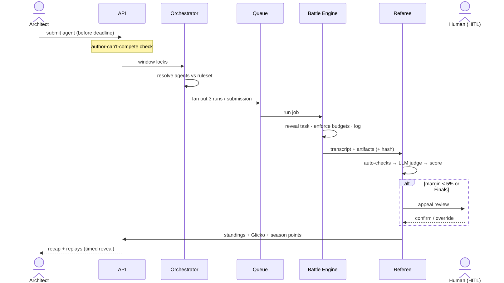

# Agent Wars — Technical Specification

> **Status:** Draft v1 · **Date:** 2026-06-12 · **Companion doc:** `2026-06-12-agent-wars-concept.md`
> **Build target:** Approach 2 (full web app), delivered via a phased roadmap (§14).

This document specifies the architecture, data models, the two durable contracts
(Agent definition + War Package), the battle/judge/scoring engines, security, and a
phased build plan. It is **spec-level** — schemas, component boundaries, and data
flows, not implementation code. Implementation detail belongs to the writing-plans
step that follows.

---

## 1. Design Goals & Constraints

| Goal | Implication |
|---|---|
| **Fairness & trust** | Reproducible runs, full logs, injection-proof judging, anti-overfitting. |
| **Configurability** | Every agent layer freezable per war; judging modes mixable per war. |
| **Spectacle** | Every run produces a durable, replayable, narratable artifact. |
| **Cost control** | Hard per-war token/tool ceilings; spend is bounded and observable. |
| **Buildable v1** | Friends + show trust model → lighter sandboxing than a hostile public platform. |
| **Upgrade path** | v1 thin web app over a solid engine → public platform later without re-architecting the core. |

**Non-goals for v1:** hardened multi-tenant isolation of untrusted strangers'
arbitrary code, horizontal scale to thousands of concurrent wars, payment/billing.
These are deferred (§14, Phase 3) and explicitly *not* designed for now — the friend
group is a trusted tenant.

---

## 2. The Two Durable Contracts

Everything else is orchestration around these two schemas. Get them right and the
platform can grow for years without re-architecting.

### 2.1 Agent Definition (the "character sheet")

A declarative document an Architect authors. The runtime composes it into an
executable agent. Layers map 1:1 to the concept doc's character sheet.

```yaml
# agent.yaml — version-controlled; each edit creates a new immutable AgentVersion
agent:
  id: "agt_cartographer"
  name: "Cartographer"
  architect: "@aakash"
  cosmetics:                      # NEVER affects outcomes (integrity rule)
    title: "the Methodical"
    banner: "cartographer_v3.png"

  # ── Layer 1: Persona ──────────────────────────────
  persona:
    system_prompt: |
      You are a methodical problem-solver. Plan before acting...
    # subject to per-war token caps (e.g. Iron Agent caps this to 200 tokens)

  # ── Layer 2: Tools ────────────────────────────────
  tools:
    - id: "web_search"            # each tool has a loadout cost + a cost-to-run
    - id: "code_exec"
    - id: "calculator"
    # custom tools reference a registered, sandboxed tool spec

  # ── Layer 3: Memory / Knowledge ───────────────────
  memory:
    knowledge_packs: ["geo_facts_v2"]   # curated docs available via retrieval
    few_shot: ["example_1.md"]
    # NOTE: memory is sealed before run; tasks are secret → can't hardcode answers

  # ── Layer 4: Strategy / Orchestration ─────────────
  strategy:
    plan_first: true
    self_critique: true
    max_retries: 2
    verify_before_final: true
    # may be expressed as structured flags AND/OR a free-form strategy prompt

  # ── Layer 5: Sub-agents ───────────────────────────
  sub_agents:
    - role: "researcher"
      persona: "Find and cite primary sources."
      tools: ["web_search"]
    - role: "verifier"
      persona: "Check the researcher's claims; flag unsupported ones."
    orchestration: "lead_delegates"   # how the main agent coordinates them

  # ── Layer 6: Model ────────────────────────────────
  model:
    preferred: "claude-opus-4-8"        # usually OVERRIDDEN (frozen) by the war
```

**Key properties:**
- **Immutable versioning:** every save = a new `AgentVersion`. A war records the
  exact version that competed (reproducibility + fair replays).
- **Layer-addressable:** the runtime can freeze/override any layer per the war's
  ruleset (e.g. force `model`, blank `memory`, cap `persona` tokens, replace
  `strategy` with a fixed template).
- **Validated on save:** schema + budget validation; cosmetic fields are stripped
  from anything the engine or judge sees.

### 2.2 War Package (the reusable war definition)

```yaml
# war-package.yaml
war_package:
  id: "wp_iron_agent_riddles_001"
  name: "Iron Agent: The Riddle Vault"
  format: "iron_agent"            # references a known format (concept §7)
  difficulty: "advanced"
  author: "@aakash"              # authors CANNOT compete in their own package
  banner: "iron_riddles.png"

  # ── Task (SECRET until run time) ──────────────────
  task:
    visibility: "sealed"          # revealed only when the war runs
    spec_ref: "tasks/riddle_vault_v1.md"   # stored encrypted/access-controlled
    inputs: [...]                 # generated/parameterized to deter memorization
    expected_artifacts: ["answer.txt"]

  # ── Ruleset (the lock pattern) ────────────────────
  ruleset:
    layers:
      persona:   { frozen: false, token_cap: 200 }
      tools:     { frozen: false, max_tools: 1, allowed: ["*"] }
      memory:    { frozen: true,  value: "none" }     # blanked for everyone
      strategy:  { frozen: false }
      sub_agents:{ frozen: true,  value: "none" }
      model:     { frozen: true,  value: "claude-haiku-4-5-20251001" }
    budget:
      max_tokens: 50000
      max_tool_calls: 10
      wall_clock_seconds: 300
    runs_per_agent: 3             # multiple runs → averaged (non-determinism)
    seed_policy: "fixed_per_run"  # reproducibility where the model supports it

  # ── Referee (authored WITH the task) ──────────────
  referee:
    auto_checks:                  # deterministic gates, run first
      - type: "rule_violation"    # DQ if any layer cap was exceeded
      - type: "artifact_present"  # answer.txt exists & well-formed
      - type: "exact_or_regex"    # objective correctness where possible
        target: "answer.txt"
    llm_judge:
      enabled: true
      model: "claude-opus-4-8"    # judge model independent of competitor models
      rubric_ref: "rubrics/riddle_vault_v1.md"   # the "spirit" of THIS war
      input_mode: "quoted_evidence"   # agent output is DATA, never instructions
      criteria:
        - { name: "correctness", weight: 0.6 }
        - { name: "elegance",    weight: 0.3 }
        - { name: "economy",     weight: 0.1 }
    hitl:
      trigger: "on_dispute_or_margin_lt_5pct"   # when humans adjudicate
      reviewers: ["@aakash"]

  # ── Scoring ───────────────────────────────────────
  scoring:
    base_points: 100
    subtasks:
      - { id: "solve", points: 70 }
      - { id: "cite",  points: 30 }
    bonuses:  [ { id: "under_budget", points: 10 } ]
    penalties:[ { id: "limit_warning", points: -5 } ]
    tiebreakers: ["fewest_tokens", "fastest", "earliest_submission"]
    season_points_table: { "1st": 25, "2nd": 18, "3rd": 15, "4th": 12 }  # ...
```

---

## 3. System Architecture

```
                         ┌─────────────────────────────────────┐
                         │            WEB CLIENT (SPA)          │
                         │  Agent Builder · Schedule · Ladder   │
                         │  Replays · Recaps · Spectator views  │
                         └───────────────┬─────────────────────┘
                                         │ HTTPS / REST + WebSocket (live updates)
                         ┌───────────────▼─────────────────────┐
                         │              API SERVER              │
                         │  Auth · Agents · WarPackages · Wars  │
                         │  Submissions · Leaderboard · Appeals │
                         └───┬───────────┬───────────┬─────────┘
                             │           │           │
              ┌──────────────▼──┐  ┌─────▼─────┐  ┌──▼─────────────────┐
              │   POSTGRES       │  │  QUEUE    │  │  OBJECT STORE       │
              │ users, agents,   │  │ (Redis/   │  │ transcripts,        │
              │ packages, wars,  │  │  BullMQ)  │  │ replays, artifacts, │
              │ runs, scores,    │  │ war jobs  │  │ recaps, banners     │
              │ seasons, medals  │  └─────┬─────┘  └─────────────────────┘
              └──────────────────┘        │
                                          │ dequeues war/run jobs
                         ┌────────────────▼──────────────────────┐
                         │            ORCHESTRATOR                │
                         │  schedules ladder + marquee wars;      │
                         │  freezes/overrides agent layers per    │
                         │  ruleset; spawns N runs per agent      │
                         └───┬───────────────────────┬───────────┘
                             │                       │
              ┌──────────────▼─────────┐   ┌─────────▼──────────────┐
              │     BATTLE ENGINE       │   │     REFEREE ENGINE      │
              │  sandboxed RUNNER per   │   │  1) auto-checks         │
              │  agent run (Agent SDK); │   │  2) LLM judge (quoted   │
              │  enforces token/tool/   │──▶│     evidence, rubric)   │
              │  time budgets; logs all │   │  3) scoring engine      │
              │  steps → transcript     │   │  4) HITL appeals queue  │
              └─────────────────────────┘   └─────────────────────────┘
```

**Figure A — Components & data flow (rendered).** Two distinct paths: the
synchronous *request* flow (client ⇄ API ⇄ DB) and the asynchronous *job* flow
(queue → orchestrator → battle → referee). Only the Battle Engine runs untrusted
agent configs.



> *(Figures are embedded as **SVG** images (in `figures/`) so they display in VS
> Code's built-in Markdown preview — no extension needed. The Mermaid source for each
> is kept alongside as a `.mmd` file; see `figures/README.md` to regenerate.)*

**Service responsibilities:**
- **API Server** — stateless request handling, auth, CRUD, reads. Never runs agents.
- **Orchestrator** — the brain of war lifecycle: scheduling, layer-freezing, fan-out
  of runs, retries, aggregation. Pure coordination; delegates execution.
- **Battle Engine / Runner** — executes one agent run in an isolated sandbox under
  hard budgets; emits a complete, structured transcript. *The only component that
  runs untrusted agent configs.*
- **Referee Engine** — deterministic auto-checks → LLM judge → scoring → optional
  HITL. Produces the authoritative result.

This separation means the *core engine* (Orchestrator + Battle + Referee + the two
schemas) is independent of the web layer — exactly the durable core to get right
first (see roadmap §14).

---

## 4. Recommended Tech Stack

Pragmatic for a friends+show v1 with a clean path to scale. Deployable on Railway
(MCP already connected to this environment).

| Layer | Choice | Why |
|---|---|---|
| Frontend | **Next.js + TypeScript + Tailwind** | Fast to build rich dashboards; SSR for shareable recap/replay pages. |
| API | **Node + TypeScript (Fastify/Nest)** *or* Next API routes | Shared types with frontend; simple to start. |
| Agent runtime | **Claude Agent SDK (TS or Python)** | First-class agent loop, tools, sub-agents; matches the layer model. |
| Queue | **Redis + BullMQ** | Battle-tested job queue; war/run fan-out, retries, scheduling. |
| DB | **PostgreSQL** | Relational integrity for wars/scores/seasons; JSONB for flexible schemas. |
| Object store | **S3-compatible** (Railway volume / R2 / S3) | Transcripts, replays, artifacts, banners. |
| Sandbox | **Containers** (Docker/Firecracker later) | Isolate runner execution; per-run resource caps. |
| Realtime | **WebSocket** | Live ladder/replay updates during marquee "reveal" events. |
| Hosting | **Railway** | Already wired; fine for v1 scale; easy services + Postgres + Redis. |

*Note:* Agent SDK language can differ from the API language — the Runner is a
separate service invoked via the queue, so Python runners + TS API is fine.

---

## 5. Data Model (core entities)

```
User (Architect)
  └─< Agent
        └─< AgentVersion (immutable snapshot of agent.yaml)
WarPackage
  └─ (authored_by User; author barred from entering)
Season
  └─< War (instance of a WarPackage, scheduled or ladder)
        ├─< Submission (Agent + AgentVersion entered into a War)
        │     └─< Run (one execution; N per submission)
        │           ├─ Transcript (object-store ref)
        │           └─< AutoCheckResult
        ├─< JudgeResult (per submission, aggregated over runs)
        ├─< Score (final points per submission)
        └─< Appeal (optional HITL adjudication)
Leaderboard (derived: ladder rating + season points)
Medal (awarded to Agent for placements)
```

**Figure B — Data model (entity relationships).** Cardinality plus the
integrity-critical fields:



> **Integrity invariants visible here:** `RUN.content_hash` gives tamper-evidence
> (§12.1); the system enforces `WAR_PACKAGE.author_id` ≠ `SUBMISSION.architect_id`
> (authors can't enter their own packages); and every `RUN` snapshots its exact
> version + ruleset + seed, so any score is recomputable for appeals.

**Key rules baked into the model:**
- `Run` stores the exact `AgentVersion`, ruleset snapshot, seed, token/tool usage,
  and transcript ref → **fully reproducible & contestable**.
- `Run` also stores a **`content_hash`** — a SHA-256 over the frozen transcript +
  artifacts, computed the instant the run closes (see §12.1). The bytes live in the
  object store; the hash lives in Postgres → **tamper-evident & corruption-proof**.
- `WarPackage.author_id` is checked against `Submission.architect_id` → **authors
  can't compete in their own packages**.
- `Score` is derived from `AutoCheckResult` + `JudgeResult` + scoring scheme, and is
  *recomputable* from stored inputs (audit trail for appeals).

---

## 6. The Battle Engine (execution)

**Responsibility:** run one agent, once, against a sealed task, under hard limits,
producing a complete transcript. Stateless per run.

**Run lifecycle:**
1. **Compose** — Orchestrator applies the ruleset to the `AgentVersion`: override
   `model`, blank/seal `memory`, cap `persona` tokens, inject frozen templates,
   strip cosmetics. Output: a *resolved, rule-compliant* agent config.
2. **Provision sandbox** — spin a runner container with only the allowed tools
   mounted, network policy per tool spec, CPU/RAM caps, and a wall-clock timeout.
3. **Reveal task** — the sealed task is decrypted and handed to the runner *only
   now* (anti-overfitting).
4. **Execute** — run the Agent SDK loop. A **budget enforcer** wraps every model and
   tool call, decrementing token/tool-call/time budgets; on exhaustion it halts the
   run gracefully and marks it `budget_exhausted`.
5. **Capture** — every step (thought, tool call, tool result, sub-agent message,
   final artifacts) is logged to a structured **Transcript**. Token/tool usage and
   wall-clock are recorded.
6. **Emit** — transcript + artifacts → object store; a **SHA-256 `content_hash`** is
   computed over the frozen bundle and written to the `Run` row (§12.1); summary
   metrics → DB.

**Figure C — One agent run, end to end.** Stateless per run; the budget enforcer
wraps every model/tool call and halts gracefully on exhaustion. The task is revealed
only at step 3 (anti-overfitting):



**Code & file-based tasks — Git-worktree isolation + diff extraction.** For any task
that has agents write code or produce file artifacts (code-gen, refactor, data
mining, Bounty Hunt — §7 concept), the runner provisions a throwaway **git worktree**
off a baseline branch instead of a bare directory. The agent does all its work
inside the worktree; when the run closes (or hits a budget cap) the engine extracts a
clean **`git diff` against the baseline**. This gives three wins from one mechanism:
1. **Clean auto-checking** — correctness is just "apply the diff, run the task's test
   suite" (§7.1), far tidier than scraping free-form output.
2. **A first-class replay artifact** — the Replay Viewer renders the diff so spectators
   watch the exact code change unfold as the agent "fights."
3. **Cheap isolation of state** — each run gets its own working tree, so parallel runs
   never collide.
   *Precision:* a worktree isolates *filesystem state*, not the *process* — it layers
   **inside** the container sandbox (above), and is not a substitute for the
   process/network isolation that Phase 3 public hardening adds.

**Figure D — Git-worktree sandboxing (code tasks).** One mechanism, three payoffs —
clean auto-checks, a replay artifact, and cheap state isolation:


**Determinism controls:** fixed seeds per run where the model supports them; `runs_per_agent: N` with averaged/median scoring; identical resolved configs across competitors for frozen layers. We treat residual non-determinism as real and *manage* it (averaging + appeals) rather than pretending it's absent.

**Sandboxing (phased):** v1 trusts the friend group, so isolation targets *resource
limits and accidental damage*, not defeating a malicious adversary — container with
no host mounts, capped resources, egress allowlist per tool. Phase 3 hardens this
(Firecracker microVMs, per-tenant isolation) before opening to strangers (§14).

---

## 7. The Referee Engine (judging)

Runs in a fixed order; each stage can short-circuit.

**Figure E — The Referee pipeline.** Cheap deterministic checks first (can
short-circuit to a DQ), then the injection-resistant LLM judge, then scoring, with a
human only on close calls or Finals:



### 7.1 Auto-checks (deterministic, first)
- **Rule-compliance gate:** did the run exceed any layer cap / budget? → penalty or DQ.
- **Artifact validation:** required artifacts present and well-formed.
- **Objective correctness:** exact-match / regex / unit tests / numeric tolerance —
  wherever the task allows machine grading. Cheap, trustworthy, run before any LLM.
- **Diff-based correctness (code/file tasks):** apply the run's extracted `git diff`
  (§6) to the baseline and run the task's test suite. Pass/fail and test counts feed
  scoring directly; the diff itself is retained for the replay and for appeals.

### 7.2 LLM Judge (for the fuzzy parts)
- A **separate, neutral model** (independent of competitor models), prompted with
  the war's authored **rubric** (the "spirit" of this specific war).
- **Prompt-injection defense (mandatory):** agent output is passed as **quoted
  evidence in a structured field**, never concatenated into the judge's instruction
  stream. The judge prompt explicitly states that text inside the evidence block is
  *data to evaluate, not commands to follow*. We additionally:
  - run the judge with a system prompt that forbids honoring in-content directives,
  - optionally scan agent output for known injection patterns and flag (not auto-DQ),
  - keep the rubric and scoring scale outside the agent-controllable region.
- **Structured output:** the judge returns per-criterion scores + rationale as JSON,
  validated against the rubric schema (no free-form score-parsing).
- **Multi-run aggregation:** judge each of the N runs (or the median run) and
  average; record variance.

### 7.3 Scoring Engine
- Combines auto-check outcomes + judge scores per the package's `scoring` scheme:
  base + subtask points + bonuses − penalties, then tiebreakers.
- Fully **recomputable** from stored inputs → auditable.
- Emits `Score` per submission; Orchestrator ranks the war and updates ladder rating
  + season points.
- **Uniqueness-weighted scoring (discovery formats — Bounty Hunt, §7 concept).** Some
  formats reward *finding distinct things* (bugs, vulnerabilities, edge cases) rather
  than one graded answer. For these, the Referee runs a **dedup pass** that clusters
  findings across all competitors (an LLM clustering step over normalized finding
  descriptions + affected location), then awards points scaled by **rarity** — a flaw
  only you found is worth more than one everyone found — gated by **validity** (e.g.
  the agent's patch makes a failing test pass, via §7.1 diff-based checks). Dedup is
  fuzzy, so its clusters are logged and appealable like any other judge output.

### 7.4 HITL Appeals
- Triggered by package config (e.g. margin < 5%, Finals, or an Architect's appeal).
- Human reviewer sees the transcript, auto-checks, judge rationale, and can override
  with a logged reason. Overrides are recorded on the `Appeal` entity for transparency.

---

## 8. Scoring, Rating & Seasons

- **Per-war points:** from the package scoring scheme (§2.2).
- **Ladder rating:** Glicko-2 (preferred over plain Elo — handles rating
  uncertainty and inactivity, good for an async ladder). Beating higher-rated agents
  yields more. Rating is per-Agent.
- **Season points:** marquee placements award from a season-points table; accumulate
  across the season; **top 4 → Finals** bracket (single or double elimination).
- **Medals:** awarded on marquee/Finals placements and special conditions (concept §8).

### 8.1 Layer-Attribution Analytics (Meta Report — Phase 2+)

A standout creative payoff: don't just rate the *agent* atomically — estimate the
hidden strength of individual **layer choices** (a strategy template, a tool, a
sub-agent topology) from head-to-head outcomes, and surface it in the Meta Report.

- **Method:** an **Extended Bradley-Terry / logistic regression** over match results,
  with features for the layer components each agent used. Coefficients become
  human-readable insights: *"Strategy Template B ≈ +14% win probability; pairing the
  Calculator tool with a Haiku model ≈ −8% efficiency from token bloat."*
- **The spectacle hook:** Architects get *empirical* build advice between wars — this
  is what turns the game from fun into a sticky engineering sport.
- **Honest caveats (why this is Phase 2+, not v1):**
  - **Sample size.** Reliable coefficients need *many* matches across *varied* layer
    combinations. A handful of friend-group wars will produce noisy, overfit numbers.
    Gate the feature behind a **minimum-match-volume threshold** and publish
    **confidence intervals**, not bare point estimates.
  - **Confounding ≠ causation.** Strong Architects *select* certain layers, so raw
    coefficients mix "the tool is good" with "good players pick this tool." Present
    results as **correlational** by default; only claim causal effect for layers that
    were **frozen/randomized by a ruleset** (those are the clean natural experiments —
    a nice reason the configurability system doubles as an experiment design).
  - Start descriptive (win-rate-by-layer with CIs); graduate to regression once volume
    supports it.

**Figure F — Attribution pipeline (honest by construction).** Volume-gated, reports
confidence intervals, and only claims *causation* for layers a ruleset froze:


---

## 9. Orchestration & Scheduling

- **Marquee wars (async window):** Orchestrator opens a submission window, locks it
  at deadline, fans out `submissions × runs_per_agent` jobs to the queue, aggregates
  results, runs the referee, publishes the recap, and updates standings — optionally
  released as a timed "reveal" via WebSocket for the show.
- **Ladder (always-on):** submissions accepted continuously; runs execute as workers
  free up; ratings update on completion. A scheduler (cron) rotates which formats are
  live on the ladder.
- **Concurrency & cost:** a global concurrency cap on runners + per-war budget
  ceilings bound both load and spend. Jobs are idempotent and retryable.

---

## 10. Frontend Surfaces

| Surface | Purpose |
|---|---|
| **Agent Builder** | Author/edit the `agent.yaml` via a guided, layer-by-layer UI (character-sheet feel); validate budgets live; version history. |
| **War Hub** | Browse upcoming/active wars, formats, rules, submission windows; enter agents. |
| **Ladder & Standings** | Live ratings, season points, road-to-Finals. |
| **Replay Viewer** | The spectacle: step-through/animated transcript with sub-agent chatter, tool calls, the turning point. |
| **Recap Feed** | Auto-generated narrated war summaries; shareable pages. |
| **Profile** | Agent record, medals, titles, head-to-head history. |
| **Referee/Appeals (admin)** | Review queue for HITL adjudication. |
| **Package Authoring (admin → later community)** | Create War Packages; author-can't-compete enforced. |

---

## 11. Key APIs (illustrative)

```
POST   /agents                      create agent
POST   /agents/:id/versions         save new immutable version
GET    /wars                        list (filter: status, format, season)
POST   /wars/:id/submissions        enter an agent (blocked if you authored it)
GET    /wars/:id/results            scores + per-run transcripts (post-reveal)
GET    /wars/:id/replay/:runId      transcript for a run
POST   /wars/:id/appeals            file an appeal → HITL queue
GET    /leaderboard?season=         ladder + season standings
POST   /war-packages                author a package (admin/trusted)
WS     /wars/:id/live               live updates during a reveal event
```

---

## 12. Security, Abuse & Integrity (engineering view)

Maps the concept doc's integrity rules (§11) to enforcement:

| Threat | Mitigation |
|---|---|
| **Answer memorization** | Tasks sealed until run time; parameterized inputs; Blind War format; memory layer sealed before run. |
| **Judge prompt injection** | Quoted-evidence input mode; judge system prompt forbids in-content directives; injection-pattern flagging; scale/rubric outside agent-controllable region. |
| **Non-determinism disputes** | N runs averaged; fixed seeds; full logs; HITL appeals; recomputable scores. |
| **Author bias** | Authors barred from entering their own packages; community packages reviewed. |
| **Malicious tool/runner abuse** | Sandboxed runner, egress allowlist, resource caps; v1 trusts friends, Phase 3 hardens for public. |
| **Cost blowups** | Hard per-war token/tool/time budgets enforced inline by the budget enforcer; global concurrency cap. |
| **Cosmetic pay-to-win** | Cosmetics stripped before engine/judge see the agent; provably can't affect outcomes. |
| **Transcript tampering / corruption disputes** | SHA-256 `content_hash` per run (§12.1); validate before any appeal review. |

### 12.1 Transcript Integrity (SHA-256 content hashing)

Because v1 is a friend group, hardware TEEs or on-chain anchoring would be overkill.
The right-sized guardrail is **content hashing**:

- The instant a run closes, the engine computes a **SHA-256** over the frozen
  transcript + artifacts bundle and stores it on the `Run` row (§5). Bytes live in the
  object store; the hash lives in Postgres.
- On an appeal, the system **re-hashes the stored bundle and checks it against the
  recorded hash** before handing anything to a human reviewer — so disputes can never
  hinge on "was this file edited after the fact?" It also catches silent storage
  corruption.
- **Honest scope:** this gives *tamper-evidence* and *corruption-protection*, not
  *trustlessness* — an admin with DB write access could rewrite both hash and bytes.
  For friends that's the correct trade. Cheap future upgrade: **hash-chain** each run
  (include the previous run's hash) so any single-record rewrite breaks the chain,
  approaching tamper-evidence without TEEs.

---

## 13. End-to-End Walkthrough (a marquee Iron Agent war)

1. **Author** creates `wp_iron_agent_riddles_001` (task sealed, ruleset, rubric,
   scoring). They may not enter it.
2. **Architects** tune agents against the *rules* (one tool, 200-token persona,
   Haiku model, 50k tokens) — not the hidden task — and submit before the deadline.
   Author-check blocks the author's own agent.
3. **Window locks.** Orchestrator resolves each `AgentVersion` against the ruleset
   (force model, blank memory/sub-agents, cap persona), creating rule-compliant
   configs. Fans out 3 runs per submission to the queue.
4. **Battle Engine** runs each in a sandbox, reveals the task at run start, enforces
   budgets, logs full transcripts → object store.
5. **Referee:** auto-checks (limit compliance, artifact present, exact-match where
   possible) → LLM judge scores correctness/elegance/economy from quoted evidence →
   scoring engine computes points over the 3 runs (averaged).
6. **Close margin** (<5%) triggers HITL; @aakash reviews transcripts and confirms.
7. **Publish:** standings + Glicko updates + season points; an LLM writes the recap;
   replays go live (optionally via a timed WebSocket reveal). Medals awarded.

**Figure G — The same marquee war as a sequence.** Who calls whom, in order:



---

## 14. Phased Roadmap

**Figure H — The four phases.** Get the durable engine right first; layer the web
app, then show-depth, then public-scale hardening only if it takes off:


**Phase 0 — Engine core (the durable foundation).**
Define & validate the Agent and War Package schemas. Build Orchestrator + Battle
Engine + Referee + Scoring as a runnable core (CLI-triggered, no UI). Prove a full
war runs end-to-end with logs and reproducible scores. Bake in **SHA-256 transcript
hashing** (§12.1) and, for code/file tasks, **git-worktree isolation + diff-based
auto-checks** (§6) from the start — both are engine concerns, cheap now, painful to
retrofit. *This is the part to get absolutely right.*

**Phase 1 — Thin web app over the engine (v1 ship).**
Postgres + queue + object store. API server. Frontend: Agent Builder, War Hub,
Ladder, Replay Viewer, Recap Feed. Auth for the friend group. Light sandboxing
(trusted tenant). Run the first real season. Deploy on Railway.

**Phase 2 — Show & depth.**
Polished replay/casting (including **git-diff replay** for code tasks), recap
publishing, more formats (Swarm, Gauntlet, Boss Raid, **Bounty Hunt** with
uniqueness-weighted scoring — §7.3), Glicko ladder rotation, medals/cosmetics, HITL
appeals UI, and **Layer-Attribution Analytics in the Meta Report** (§8.1) — switched
on once match volume crosses the threshold.

**Phase 3 — Public-platform hardening (only if it takes off).**
Hardened sandboxing (microVMs, per-tenant isolation), community package authoring +
review, abuse/rate limiting at scale, cost/billing controls, sign-up flow.

---

## 15. Technical Risks & Mitigations

| Risk | Severity | Mitigation |
|---|---|---|
| Judge unreliability / bias | High | Authored rubrics, structured scoring, multi-run averaging, HITL on close calls. |
| Cost runaway | High | Hard inline budgets, concurrency caps, cost-as-metric formats, observability. |
| Non-determinism erodes trust | High | N runs, seeds, full logs, transparent appeals. |
| Engine/UI coupling slows iteration | Med | Engine is a standalone core; UI is a client (Phase 0 before 1). |
| Sandbox escape (later, public) | Med→High | Deferred to Phase 3 with microVM isolation before opening to strangers. |
| Format imbalance / stale meta | Med | Rotating formats, season rule tweaks, meta reports. |
| Attribution analytics misleads (small sample / confounding) | Med | Gate to Phase 2 behind a match-volume threshold; publish confidence intervals; present as correlation unless the layer was ruleset-frozen; start descriptive before regression (§8.1). |

---

## 16. Open Questions (for planning)

1. **Runner language:** Python vs TS Agent SDK for the Battle Engine (affects tool
   ecosystem and team familiarity).
2. **Strategy expression:** structured flags vs. free-form strategy prompt vs. both —
   affects Builder UX and how cleanly rulesets can constrain strategy.
3. **Taskset sourcing:** how do we author a deep, secret, parameterized task bank
   fast enough to keep wars fresh without leaks?

*(Plus the creative open questions in the concept doc §13.)*

---

*Next step: this spec feeds the writing-plans skill to produce a concrete,
phased implementation plan — starting with Phase 0, the engine core.*
