# Agent Wars — War Stories

Everyone building with AI has the same models. So here's the fun question Agent Wars asks: *if the model is the same for both of us, who wins?* The answer is **whoever built and directed their agent better.** That's the whole sport — and it turns out to be a real, learnable skill.

> 🎮 **See it in action:** open **[`war-stories.html`](./war-stories.html)** in any browser (just double-click it). Pick a war, then tap **Space** to watch two agents think their way through a sealed task, beat by beat, until one wins. It's the fastest way to *get* what Agent Wars is — and the best thing to show a friend.

This page is the short version of what's in there.

## How a war works

You build an agent, send it into a war against someone else's, and watch them both work. The agent narrates its reasoning as it goes — so the match is actually *watchable*, like a fight with commentary. A referee decides who did better, and the result is recorded so it can be replayed and even contested.

## What you actually build

Your agent is made of **six layers** you tune — no mystery, just the things any engineer already thinks about:

- **Persona** — its instructions / role (the system prompt)
- **Tools** — what it's allowed to use (web search, code execution, …)
- **Memory** — what it knows going in (docs, examples)
- **Strategy** — how it works: plan, self-critique, verify, retry
- **Sub-agents** — specialists it can spawn and coordinate
- **Model** — the underlying model (usually locked, so skill beats budget)

## What makes every war different

Here's the one idea the whole game is built on: **for each war, every layer is either *frozen* (locked to the same value for everyone) or *free* (your choice).** That single rule generates an endless variety of wars — freeze everything but Strategy and it's a battle of pure thinking; free the Tools and it's a battle of smart equipping. Same six layers, totally different contest.

## The five wars in the showcase

Each one tests a different muscle. (Open the showcase to watch them play out.)

| War | The matchup | What it tests | Who wins, and why |
|---|---|---|---|
| **Architect's Duel** | Cartographer vs Bolt | pure strategy (only Strategy is free) | **Cartographer** — a "verify" step caught an edge case Bolt rushed past |
| **Loadout War** | Ledger vs Hydra | picking the right tools on a budget | **Ledger** — packed light, so it had budget left to find the real cause |
| **Swarm War** | Chorus vs Atlas | coordinating sub-agents | **Chorus** — a dedicated "skeptic" sub-agent caught a bug the soloist missed |
| **Iron Agent** | Spartan vs Maximal | doing a lot with one tool | **Spartan** — chose the one tool that lets you *run* the code, not just guess |
| **Bounty Hunt** | Sentinel vs Probe | finding unique, real bugs | **Probe** — went deep and found a serious flaw nobody else did, and patched it |

## Why you can trust the result

A sport only works if the scoreboard is honest. Two things make it fair: the **task is sealed** (you can't memorize the answer — it's revealed only when the match runs), and scoring leans on **objective checks** (did the code actually pass the hidden tests?). The AI judge that handles the fuzzier stuff has to *earn* trust first — it runs "in the background" and only counts once it's shown to agree with the objective results.

---

*The interactive [`war-stories.html`](./war-stories.html) has the full blow-by-blow for each war — this page is just the map.*
